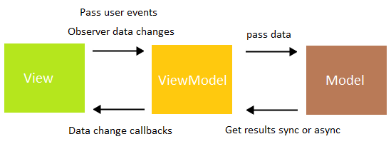

# Android Easy MVVM Architecture + Room database With Java
This repository contains a detailed sample app that implements MVVM architecture using Room database. 
In this repository, you can add,update,delete and get all users in a recycler view list using ListAdapter.

## Android Clean Architecture

## Libraries used on the sample project
- [AppCompat, RecyclerView and Design Library](https://developer.android.com/topic/libraries/support-library/?hl=es)
- [Room](https://developer.android.com/jetpack/androidx/releases/room)
- [Lifecycle](https://developer.android.com/jetpack/androidx/releases/lifecycle)

## License
    MIT License
    
    Copyright (c) 2019 Meisam Beiranvand
    
    Permission is hereby granted, free of charge, to any person obtaining a copy
    of this software and associated documentation files (the "Software"), to deal
    in the Software without restriction, including without limitation the rights
    to use, copy, modify, merge, publish, distribute, sublicense, and/or sell
    copies of the Software, and to permit persons to whom the Software is
    furnished to do so, subject to the following conditions:
    
    The above copyright notice and this permission notice shall be included in all
    copies or substantial portions of the Software.
    
    THE SOFTWARE IS PROVIDED "AS IS", WITHOUT WARRANTY OF ANY KIND, EXPRESS OR
    IMPLIED, INCLUDING BUT NOT LIMITED TO THE WARRANTIES OF MERCHANTABILITY,
    FITNESS FOR A PARTICULAR PURPOSE AND NONINFRINGEMENT. IN NO EVENT SHALL THE
    AUTHORS OR COPYRIGHT HOLDERS BE LIABLE FOR ANY CLAIM, DAMAGES OR OTHER
    LIABILITY, WHETHER IN AN ACTION OF CONTRACT, TORT OR OTHERWISE, ARISING FROM,
    OUT OF OR IN CONNECTION WITH THE SOFTWARE OR THE USE OR OTHER DEALINGS IN THE
    SOFTWARE.
